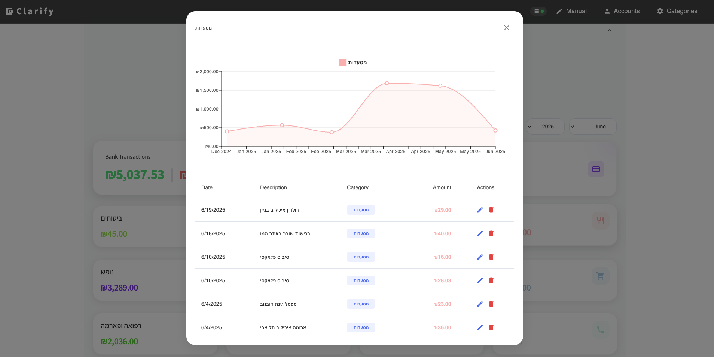
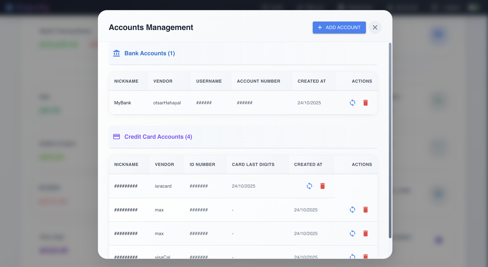
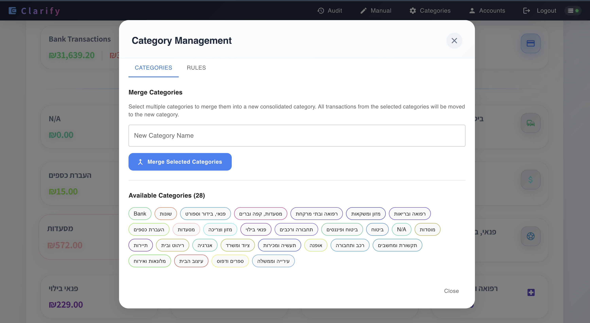

# Clarify

Personal finance management app for tracking income, expenses, and bank transactions with automatic categorization.

**Stack:** Next.js · PostgreSQL · TypeScript · Material-UI

---

## Features

- 🏦 Automatic bank scraping (Israeli banks)
- 📝 Manual transaction entry
- 🔐 Password-protected with encrypted credentials (AES-256-GCM)
- 📊 Category-based tracking and analytics
- 🎯 Monthly/yearly financial summaries
- ⚙️ Customizable categorization rules

---

## Setup

**Prerequisites:** Node.js 20+, PostgreSQL 16+

### Quick Start

1. **Clone and install**
   ```bash
   git clone https://github.com/clarify/clarify-expenses.git
   cd clarify-expenses/app
   npm install
   ```

2. **Configure environment**
   
   Create `.env` in the root directory:
   ```env
   CLARIFY_DB_USER=myuser
   CLARIFY_DB_HOST=localhost
   CLARIFY_DB_NAME=mydb
   CLARIFY_DB_PASSWORD=mypassword
   CLARIFY_DB_PORT=5432
   CLARIFY_ENCRYPTION_KEY=<64-char-hex>
   CLARIFY_AUTH_PASSWORD=<your-password>
   ```
   
   Generate encryption key:
   ```bash
   node -e "console.log(require('crypto').randomBytes(32).toString('hex'))"
   ```

3. **Run**
   ```bash
   npm run dev
   ```
   Open http://localhost:3000

### Docker

```bash
docker-compose up -d
```

---

## Environment Variables

| Variable | Description |
|----------|-------------|
| `CLARIFY_DB_*` | PostgreSQL connection details |
| `CLARIFY_ENCRYPTION_KEY` | 64-char hex key (use generator above) |
| `CLARIFY_AUTH_PASSWORD` | App login password |

---

## Screenshots

<table>
  <tr>
    <td><br/><sub>Dashboard</sub></td>
    <td><br/><sub>Category View</sub></td>
  </tr>
  <tr>
    <td><br/><sub>Account Management</sub></td>
    <td><br/><sub>Category Management</sub></td>
  </tr>
</table>

---

## License

MIT License - See [LICENSE](LICENSE) file for details.

## Credits

Bank integration: [`israeli-bank-scrapers`](https://github.com/eshaham/israeli-bank-scrapers)
