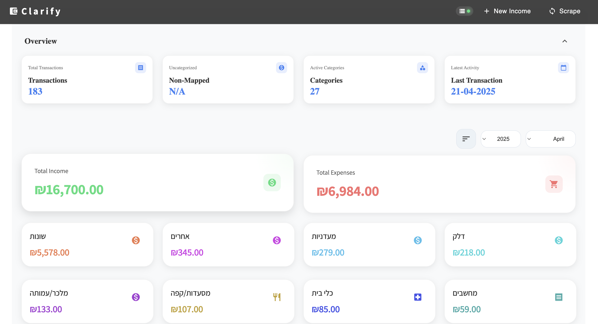
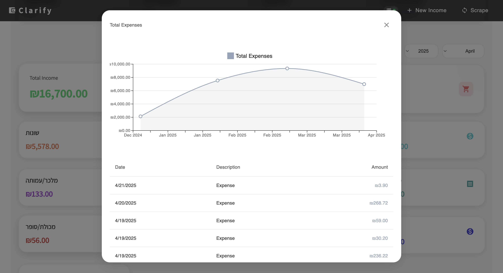
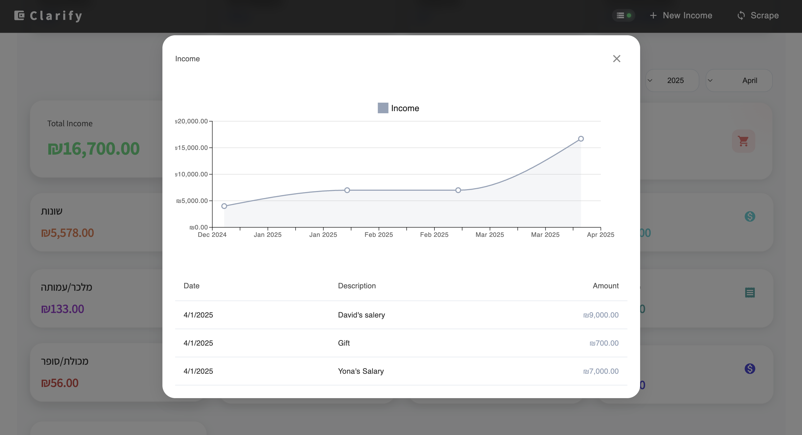

# Clarify – Know Where Your Money Goes

**Clarify** is a sleek, full-stack web app for managing your personal finances. It helps you keep track of income and expenses, automatically categorizes your transactions, and gives you monthly and yearly summaries—all in one clean dashboard.

Built with **Next.js**, **PostgreSQL**, and **Material-UI**, Clarify aims to create clarity and control over your money.

---

## 🔑 Features

### 💸 Smart Finance Tracking
- **Automatic transaction import** from Israeli banks and credit vendors  
- **Category-based tracking** for all expenses  
- **Income management** with custom tagging  
- **Monthly & yearly summaries** to see your financial health at a glance  

### 📊 Analytics & Insights
- Visual breakdown of your income and expenses  
- Spending trends over time  
- Overview of cash flow and category-wise distribution  

### 📸 Screenshots

#### Dashboard Overview

#### Expenses

#### Income

---

## 🧰 Tech Stack

- **Frontend**: Next.js, React, TypeScript, Material-UI  
- **Backend**: Next.js API Routes  
- **Database**: PostgreSQL  
- **Deployment**: Docker & Docker Compose  
- **Bank Integration**: [`israeli-bank-scrapers`](https://github.com/eshaham/israeli-bank-scrapers)

---

## 🚀 Getting Started

### Prerequisites

- Node.js (v20 or higher)  
- PostgreSQL (v16 or higher)  
- Docker & Docker Compose (optional, for container deployment)

---

### Local Development

1. **Clone the repository**
   git clone https://github.com/clarify/clarify-expenses.git  
   cd clarify-expenses

2. **Install dependencies**
   cd app  
   npm install

3. **Create a `.env` file** in the main directory:
   DB_USER=myuser  
   DB_HOST=localhost  
   DB_NAME=mydb  
   DB_PASSWORD=mypassword  
   DB_PORT=5432

4. **Start the development server**
   npm run dev

---

### 🐳 Docker Deployment

1. Build and run the app using Docker:
   docker-compose up -d

2. Open your browser at:  
   http://localhost:3000

---

## 🗂 Project Structure

clarify-expenses/  
├── app/                    # Next.js application  
│   ├── components/         # Reusable UI components  
│   ├── pages/              # App pages and API routes  
│   ├── public/             # Static files  
│   └── styles/             # Global CSS and theme  
├── db-init/                # PostgreSQL initialization scripts  
├── docker-compose.yaml     # Docker config for services  
└── README.md               # You're reading it

---

## 📦 Environment Variables

| Variable      | Description               |  
|---------------|---------------------------|  
| DB_USER       | PostgreSQL username       |  
| DB_HOST       | PostgreSQL host           |  
| DB_NAME       | Database name             |  
| DB_PASSWORD   | PostgreSQL password       |  
| DB_PORT       | Database port (default: 5432) |

---

## 🤝 Contributing

Contributions are welcome! If you have suggestions, bug reports, or feature requests, open an issue or submit a pull request.

---

## 📄 License

This project is licensed under the MIT License. See the LICENSE file for more details.

---

## 💬 Support

For support, open an issue in this repository.

---

## 🙌 Credits

- Bank scraping integration powered by [`israeli-bank-scrapers`](https://github.com/eshaham/israeli-bank-scrapers)  
- Built with ❤️ using modern open-source tools
