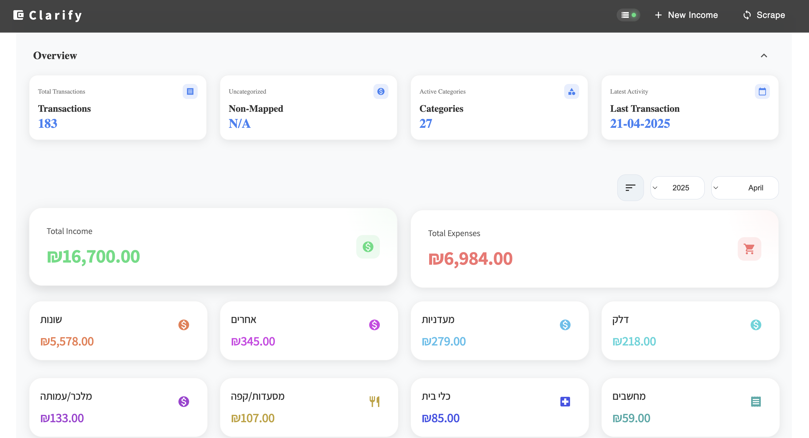
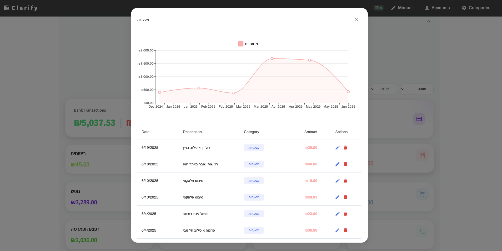

# Clarify

A premium personal finance management application designed for clarity, control, and visual excellence. Track your income, expenses, and savings with automatic categorization and a modern, high-performance UI.

**Stack:** Next.js · PostgreSQL · TypeScript · Material-UI · Docker

---

## 🚀 Key Features

- **🏦 Smart Bank Scraping**: Automatic transaction importing via `israeli-bank-scrapers`.
- **🔄 Recurrent Transactions**: Integrated management of monthly rules (Rent, Salary, etc.) within the main Finance dashboard.
- **📈 Savings & Investments**: Dedicated dashboard to track your growing wealth and assets.
- **📊 Dynamic Analytics**: Category tiles auto-sorted by transaction volume to highlight your top spending areas.
- **🛡️ Secure & Private**: AES-256-GCM credential encryption and password-protected authentication.
- **⚙️ Pro Management**: Unified modal for account connectivity, categorization rules, and data cleanup.

---

## 🛠️ Quick Start

**Prerequisites:** Node.js 20+, Docker (Optional)

1. **Install Dependencies**
   ```bash
   git clone https://github.com/clarify/clarify-expenses.git
   cd clarify-expenses/app && npm install
   ```

2. **Configure Environment**
   Create a `.env` file in the root with your database credentials and encryption keys (see `.env.example`).
   ```bash
   # Generate your encryption key:
   node -e "console.log(require('crypto').randomBytes(32).toString('hex'))"
   ```

3. **Launch the Dashboard**
   ```bash
   # Option A: Standard Dev Server
   npm run dev
   
   # Option B: Docker Compose
   docker-compose up -d
   ```
   Open `http://localhost:3000`

---

## 📉 Visual Insights

| Dashboard | Categories |
|-----------|------------|
|  |  |

---

## 📜 Credits & License

- Bank integration powered by [`israeli-bank-scrapers`](https://github.com/eshaham/israeli-bank-scrapers).
- Licensed under [MIT](LICENSE).
